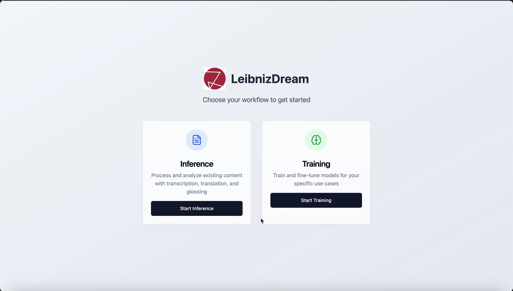

# TGT – Overview



## What is TGT?

TGT (Transcription Glossing Translation) is an end-to-end system designed to support linguistic data processing workflows.

It provides a unified pipeline that integrates:

- Automatic Speech Recognition (ASR) for transcription
- Machine Translation (MT) for translation
- Glossing models for linguistic annotation
- Data handling utilities for structured datasets such as Excel and CSV files

The system is designed to be usable by non-technical users while maintaining a modular and extensible backend architecture that allows developers to integrate new models or processing strategies.

---

## Key Capabilities

- Process raw linguistic data including audio and text
- Automate repetitive annotation tasks such as transcription, translation, and glossing
- Support multiple model providers, both local and API-based
- Handle structured datasets and spreadsheet-based workflows
- Provide a web-based interface for interaction

---

## Design Goals

- Modularity
- Extensibility
- Reproducibility
- Usability
- Deployment flexibility

---

# Setup Guide

## Prerequisites

- Python 3.11+
- uv
- Node.js 18+
- Nginx (only needed for server deployment)
- OpenSSL (only needed for HTTPS certificate generation)

---

# Configuration

## Environment Variables

Create a `.env` file in:

```text
backend/materials/.env
```

This file stores API keys and configuration secrets.

Without this file, OneDrive integration and some models will not be available.

### Example `.env`

```env
# Hugging Face API Key
HUGGING_KEY=your_huggingface_api_key_here

# Azure / OneDrive
TENANT_ID=your_azure_tenant_id_here
CLIENT_ID=your_azure_client_id_here
CLIENT_SECRET=your_azure_client_secret_here

# Optional: DeepL
DEEPL_API_KEY=your_deepl_api_key_here

# Optional: Google Gemini
GOOGLE_API_KEY=your_google_gemini_api_key_here
```

Never commit `.env` files to GitHub.

---

# Installation

## 1. Clone Repository

```bash
git clone https://github.com/LeibnizDream
cd TGT
```

---

## 2. Backend Setup

```bash
cd backend
uv sync
```

Activate the environment:

### macOS / Linux

```bash
source .venv/bin/activate
```

### Windows

```bash
.venv\Scripts\activate
```

---

## 3. Frontend Setup

```bash
cd ../frontend
npm install
npm run build
```

---

## 4. Start the Application Locally

From the backend directory:

```bash
cd ../backend
uv run uvicorn app:app --host 127.0.0.1 --port 8000
```

The application will be available at:

```text
http://127.0.0.1:8000
```

Port `8000` is completely fine for production as long as Uvicorn remains bound to:

```text
127.0.0.1
```

and is only exposed through Nginx.

---

# Server Deployment with Nginx and HTTPS

The deployment architecture is:

```text
Browser
  ↓ HTTPS
Nginx
  ↓ HTTP on localhost
Uvicorn / FastAPI
```

Nginx receives HTTPS requests and forwards them internally to:

```text
127.0.0.1:8000
```

---

# HTTPS Setup

## 1. Create SSL Directory

Create:

```text
C:/nginx/ssl
```

---

## 2. Create OpenSSL Configuration File


Copy openssl.cnf file to:

```text
C:/nginx/ssl/openssl.cnf
```

---

## 3. Generate Private Key

Open a terminal in:

```text
C:/nginx/ssl
```

Run:

```bash
openssl genrsa -out selfsigned.key 2048
```

This creates:

```text
selfsigned.key
```

This is the private key.

Never commit this file to GitHub.

Never share it publicly.

---

## 4. Generate Self-Signed Certificate

From the same directory:

### Windows CMD

```bash
openssl req -x509 -nodes ^
-days 365 ^
-key selfsigned.key ^
-out selfsigned.crt ^
-config openssl.cnf
```

### PowerShell / Linux / macOS

```bash
openssl req -x509 -nodes \
-days 365 \
-key selfsigned.key \
-out selfsigned.crt \
-config openssl.cnf
```

This creates:

```text
selfsigned.crt
```

The final structure should look like:

```text
C:/nginx/
├── conf/
│   └── nginx.conf
├── html/
├── logs/
└── ssl/
    ├── openssl.cnf
    ├── selfsigned.crt
    └── selfsigned.key
```

---

# Nginx Configuration

Copy `nginx.conf` to:

```text
C:/nginx/conf/nginx.conf
```

---

# CLI Usage

The backend can also be used directly from the terminal.

Run from the backend directory:

```bash
python -m inference.worker <action> <language> <base_dir> [options]
```

## Arguments

| Argument | Description |
|---|---|
| `action` | `transcribe`, `translate`, `gloss`, or `transliterate` |
| `language` | Language name or code |
| `base_dir` | Path to data |

## Options

| Option | Description |
|---|---|
| `--format` | `plain` or `labvanced` |
| `--instruction` | `automatic`, `corrected`, or `sentences` |
| `--translation-model` | Translation model |
| `--glossing-model` | Glossing model |

---

# Examples

## Transcribe Audio Files

```bash
python -m inference.worker transcribe english /data/recordings
```

## Translate a Folder

```bash
python -m inference.worker translate german /data/recordings --translation-model gemini
```

## Process Labvanced Export

```bash
python -m inference.worker transcribe greek /data/experiment --format labvanced --instruction automatic
```

## Gloss Dataset Using Local Qwen

```bash
python -m inference.worker gloss turkish /data/experiment \
  --format labvanced \
  --instruction sentences \
  --glossing-model qwen \
  --translation-model qwen
```

---

# Ruff Linting

```bash
uv run ruff check .
uv run ruff check . --fix
uv run ruff format .
```

---

# Ollama / Local Qwen Setup

Install Ollama:

```text
https://ollama.com
```

Pull a model:

```bash
ollama pull qwen2.5:7b
```

Once Ollama is running locally, the application can use local inference without API keys.

---

# Security Notes

Never commit:

```text
.env
*.key
```

Recommended `.gitignore`:

```gitignore
.env
*.key
*.pem
```

Safe to commit:

```text
openssl.cnf
nginx.conf
```

---

# Troubleshooting

## Verify Python Version

```bash
python --version
```

## List Installed Packages

```bash
uv pip list
```

## Re-sync Dependencies

```bash
uv sync
```

## Reload Nginx

```bash
nginx -s reload
```

---

# Support

For additional help:

- Contact the project administrator
- Check application logs
- Verify all environment variables
- Ensure Nginx and Uvicorn are both running